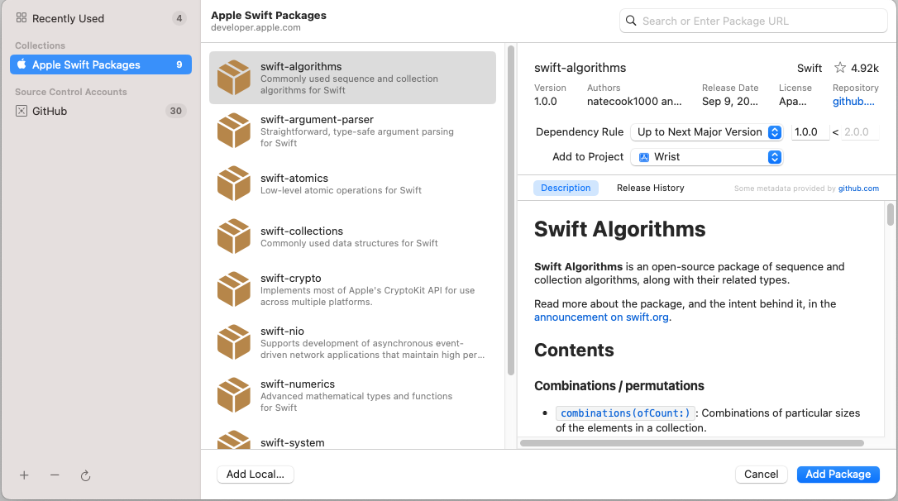

# Swift Package Manager

### ChatGPT의 답변

스위프트 패키지 매니저(Swift Package Manager)는 Swift 언어로 작성된 패키지를 관리하기 위한 공식 패키지 매니저입니다. 이 도구를 사용하면 Swift 언어로 작성된 프로젝트에서 필요한 종속성 패키지를 관리하고, 빌드 및 테스트를 자동화하며, 패키지를 배포할 수 있습니다. Swift Package Manager는 리눅스와 macOS에서 사용 가능하며, Swift 3.0 버전 이상에서 사용할 수 있습니다. 

### 그래서 뭐 어쩌란거

대충 CocoaPods 안쓰고 프로젝트에 라이브러리 추가가 가능하게 xcode에 추가된 기능 
프로젝트 > PROJECT > Pakage Dependencies > + 눌러서 추가 가능

여기서 원하는 라이브러리 등 추가 가능함. 

??: 근데 여기에 내가 원하는거 안나오는데; 
자, 이제 깃헙가서 원하는 레파지토리들을 Star 주고 xcode에 깃헙 로그인을 해보자. 그러면 내가 눌렀던 레파지토리들을 가져올 수 있다. 개꿀딱인점은 Major랑 Minor로 정해서 가져올 수 있다. 아님 원하는 브랜치로도 가능함 개꿀임. 
추가로 걍 링크 긁어다가 위에 검색창에 치면 나오긴하는데 필자는 Star 박고 받은 담에 나중에라도 해당 레파지토리 들어가서 볼 일이 있을거 같아서 Star박는걸 추천함. 

### 장점이 뭐임

개떡같이 .gitignore로 pods폴더를 추가할 필요도 없음. 
당연하게 가독성 시궁창 podfile이랑 podfile.lock, .xcworkspace도 안생김. ㅋㅑ...
